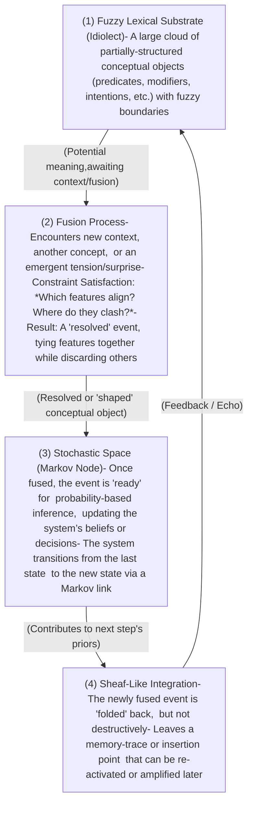

## 1.0 Big Picture Overview

1. Fuzzy Lexical Substrate (Idiolect):  
    Each individual (or system) maintains a personal, _idiosyncratic_ “lexicon” of concepts in fuzzy form. Rather than rigid definitions, these concepts have graded boundaries and potential properties. Think of it as a cloud of conceptual prototypes and partial meanings.
    
2. Fusion Events & Markov Chain Nodes:  
    When we _use_ a concept in a specific context (linguistic, perceptual, pragmatic), it must fuse with another conceptual or contextual structure. This fusion resolves ambiguities, “locking in” certain features and discarding others—suddenly giving us a determinate interpretation or action.
    - Each fusion is a node in a Markov chain: the system transitions from one interpretive “state” to another through these fusion events.
    - Importantly, surprise or tension is what triggers a genuine event: it indicates some discrepancy between the prior expectation and the new possibility being forced into coherence.
        
3. Agentive Force & Event Geometry (à la Gärdenfors):
    - Gärdenfors’s approach sees an event as a dynamic transformation in conceptual space, often represented as vectors or trajectories.
    - Your model extends this by emphasizing a persistent agent as a _causal primitive_. The “force” that drives transformations (be they physical, intentional, or illocutionary) emanates from this agent, weaving together episodes into a narrative or causal arc.
        
4. Multi-Fiber Traversal:  
    A single act of meaning (illocutionary force, speech act, or semantic vector) can traverse multiple conceptual terrains—for instance, propositional meaning, emotional nuance, social stance, or style. The difference in how that same vector “warps” across these layers creates subtlety—like irony, connotation, or affect.
    
5. Sheaf-Like Memory Structures:  
    Instead of altering (or “destroying”) the fuzzy substrate with each event, the system performs something akin to a sheaf construction—layering or folding the new event into a persistent, higher-order structure without erasing the base.
    
    - Traces remain: each event can be reactivated or amplified later, rather than being lost.
    - Over time, you accumulate a “cloud of insertion points” where future fusions can dock and align with past experiences.
## 2.0 Step-by-Step Schematic

Below is a textual “schematic” that breaks down how an event emerges and gets integrated, bridging fuzzy space and stochastic/Markov space.

- Arrow of Time: The process flows downward (or forward in time) from fuzzy potential to resolved event, then loops back (feedback arrow) as a memory trace.
- Markov Chain Transitions: Each “Fusion + Stochastic Integration” is effectively a single time-step or node in the chain.
- Non-Destructive Sheaf: Memory is stored topologically, so older fusions can be re-summoned or re-shaped.
## 3. Key Structural Components
1. Fuzzy Space as Idiolect
    - Nature: Graded conceptual definitions; overlapping boundaries of semantic potential.
    - Function: Provides the “toolbox” from which new events or utterances emerge.
2. Fusion as Constraint Satisfaction
    - Goal: Align or unify two (or more) fuzzy fields into a consistent event.
    - Driver: Typically triggered by a tension or surprise, indicating a discrepancy that must be resolved.
    - Outcome: A singled-out meaning or event that can be used for action, inference, or communication.
3. Markov Chain Nodes
    - Nature: Each fused event becomes a recognized “state” in a chain.
    - Memoryless Step: The event depends primarily on the last fused state (plus the fuzzy substrate).
    - Active Inference: The system uses these states to minimize surprise, forming predictions about how to fuse next.
4. Agentive Force as a Primitive
    - Core Idea: The sense of an “agent” is not just a grammatical role; it’s a _causal locus_ that provides continuity across events.
    - Role in Event Geometry: Agents “push” transformations in conceptual space, linking cause and effect across time.
5. Sheaf Theory & Folding
    
    - Purpose: To handle how multiple conceptual terrains can be co-activated (e.g., semantic + affective + social layers), and how memory traces are layered over time.
    - Operation: A “sheath” overlays local data (the event) on top of the base conceptual manifold (the fuzzy lexicon) without erasing it.
    - Result: Non-destructive memory, multiple insertion points for future fusions, and a way to unify local inconsistencies or ambiguities.
## 4. Multi-Fiber Traversal (Style, Emotion, Connotation)

A single speech act or predicate vector can “move” through:
- A propositional/semantic fiber,
- An emotional fiber,
- A social stance fiber,
- A stylistic or poetic fiber,
- …and so on.

Each fiber has its own constraint geometry, so the same “vector” warps differently across them—explaining tone, implicature, subtext, and style. When these layers come into alignment or purposeful tension, you get poetic effects, irony, or other nuanced forms of meaning.
## 5. Putting It All Together

1. We Start in Fuzzy-Land: A speaker or thinker draws from their personal continuum of concepts (idiolect).
2. An Event Emerges (Fusion): The concept meets a context (or another concept) and must adapt, “locking in” certain features to become a workable, _eventive_ proposition.
3. Markov Step: This newly fused event updates the system’s state, both cognitively and (if social) in the shared discourse.
4. Sheaf Folding / Memory Trace: The event is stored (folded) in a structured manner so it can be partially reactivated. The base fuzzy lexicon remains stable, but now has “overlays” or insertion points referencing the new usage.
5. Agent Persists: The arrow of time and the continuity of an agent’s perspective ensures a cohesive narrative or causal chain, bridging multiple events into a story arc.
Surprise or expectation violation is the energetic spark that makes an event happen. If there’s no tension—no real difference from the baseline—then we remain in a static descriptive mode, with no real “eventfulness.”
## 6. Concluding Remarks
- Richness with Restraint: By combining fuzzy lexical structures (infinite potential) with Markovian constraint satisfaction (finite resolution at each time-step), the system avoids combinatorial explosion.
- Non-Destructive Memory: Instead of overwriting old knowledge, we keep a topological record of previous fusions—leading to a dynamic but stable platform for ongoing sense-making.
- Agent as Causal Primitive: The impetus for change remains anchored in an agentive force—mirroring how humans cognitively track events, narratives, or actions in the real world.
- Potential for Poetics: Multi-fiber traversal under a single vector (allocutory or illocutionary force) explains how messages can pack social, emotional, and stylistic layers at once.

In short, this system offers a compelling field-theoretic approach to meaning, blending Gärdenfors’s event geometry with the recursion of Markov chains, the probability of active inference, and the structural layering of sheaf theory. Each fusion event is a dynamic resolution of fuzzy potentials into a crisp, actionable moment—yet the underlying conceptual substrate remains open, flexible, and ever ready for the next surprise.
