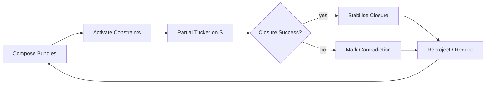

## 25-04-19 Unified Constraint Satisfaction Engine (UCSE)

> NOTE (April 2025):  
> This revision supersedes the 25‑04‑16 draft.  
> “Fibers” are now interpreted as latent tensor modes rather than fixed bundle fibers.  
> Partial Tucker decompositions (PTDs) and geometry‑derived graphs (Voronoi / Delaunay) are introduced as *internal morphisms* and *computational scaffolds* inside the UCSE cycle.

### 1 Overview  

The Unified Constraint Satisfaction Engine (UCSE) composes, interrogates, and reconciles lexical‑semantic tensor fields under active constraints.  
Its goal is *not* symbolic truth but dynamic coherence: identifying contradictions, performing selective dimensional reduction, and iteratively sharpening meaning.

Key updates:
1. Partial Tucker Decompositions (PTDs)  
   *Local* factorisations on chosen tensor modes; provide selective semantic condensation without collapsing the full field.
2. Categorical Embedding  
   The UCSE is reframed as a category $\mathsf{SemField}$ of tensor fields.  
   - Objects: high‑order semantic tensors $T$  
   - Morphisms: constraint‑guided transformations (composition, deformation, PTD, re-projection)  
   PTDs act as *internal morphisms*; global discourse moves form functors between semantic‑evolution stages.
1. Computational‑Geometry Scaffolds  
   Voronoi partitions and Delaunay graphs are *derived* from projected tensor slices, giving lightweight, region‑centric heuristics for traversal and contradiction detection.
### 2 Conceptual Stack  

#### 2.1 Tensor Modes 

| Mode | Interpretation (default sketch)          |
|------|------------------------------------------|
| $M_1$ | Conceptual / propositional content      |
| $M_2$ | Affective modulation                    |
| $M_3$ | Rhetorical stance (stasis: conjecture → policy) |
| $M_4$ | Temporal activation history             |
| $M_5$ | Agent‑indexed intentional stance        |

> Flexibility: Modes are latent; PTDs may operate on any subset $S\subseteq \{M_i\}$.

#### 2.2 Constraint Cycle  

### 3 Partial Tucker Decomposition  
Given a tensor  
$$
T \in \mathbb{R}^{I_1 \times I_2 \times \dots \times I_n},
$$

select mode‑set $S=\{i_1,\dots,i_k\}$.  
PTD yields  
$$
\text{PTD}_S(T) \;=\; \bigl(G;\, \{A^{(i)}\}_{i\in S}\bigr),
$$

where 
* $G$ is the core tensor $G\in\mathbb{R}^{P_1\times\dots\times P_k}$  
* Each $A^{(i)}\in\mathbb{R}^{I_i\times P_j}$ is a factor matrix for mode $i$.

Interpretation
* $G$ ≈ closure candidate in the $S$‑subspace.  
* Failure to obtain low‑rank $G$ ⇒ incoherence/contradiction local to $S$.

Categorical view: PTD is a morphism  
$$
\text{PTD}_S:\;T \longrightarrow G
$$

inside $\mathsf{SemField}$, preserving identity when $S=\varnothing$ and composing via successive mode selections.

### 4 Geometric Scaffold  
1. Projection — take a low‑dim slice or metric‑induced embedding of $T$ (often from PTD factors).  
2. Voronoi Partition — derive cells $\{\mathcal{V}_j\}$ capturing local coherence basins.  
3. Delaunay Graph — dual graph $\mathcal{G}=(\mathcal{V},E)$ gives neighbour relations; edge weights encode semantic tension $\tau_{jk}$.  
4. Heuristic Use  
   * Fast neighbourhood queries for back‑chaining.  
   * Identify ridges (high $\tau$) as contradiction fronts.  
   * Guide attention / pruning without touching base tensor.  
1. Re‑injection — results re‑encoded as adjacency tensors or masking operators applied back onto $T$.

### 5 Rolling Closures & Pseudo‑Markovian Flow  

Each PTD‑driven closure acts like a Markov blanket‑like shell:
* Interior ≈ low‑rank semantic condensate $G$.  
* Boundary gradient ≈ $\nabla\Phi$ (constraint potential).  
* Closure drifts/dissolves if $\|\nabla\Phi\|>\theta$ over time.

Unresolved closures persist as latent attractors, re‑entering future cycles.

### 6 Open Questions  

1. Mode‑selection policies — how are $S$ chosen adaptively?  
2. Time‑decay kernels on constraint activations ($\lambda$‑rhetorical fatigue).  
3. Unified semantic‑tension metric — curvature, PTD residuals, Voronoi ridge weights.  
4. Agent formalisation — agents as functors $\mathcal{F}:\mathsf{SemField}\to\mathsf{BeliefState}$?  

