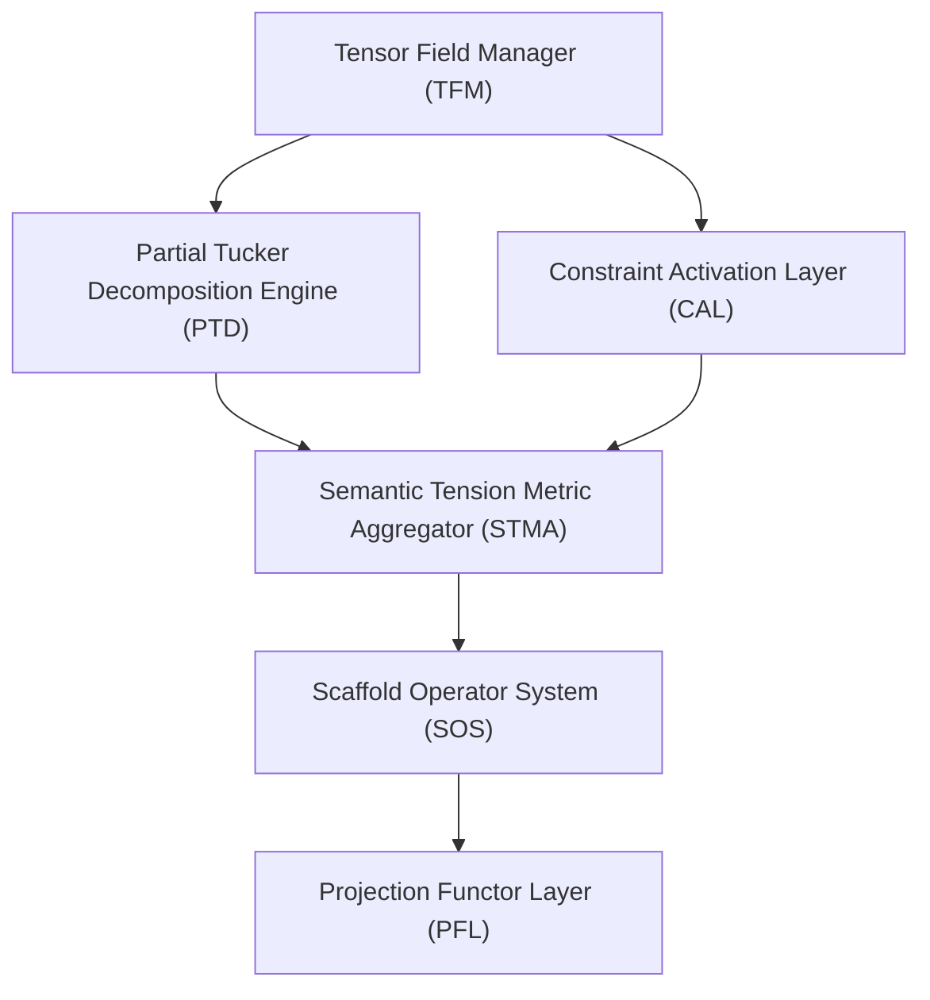

# UCSE Engineering Specification

## 1.0 Overview

The UCSE Engine orchestrates dynamic semantic resolution through modular, field-based constraint satisfaction.  
It operates over high-dimensional tensor fields, applying partial decompositions, semantic tension monitoring, scaffold formation, and topologically faithful belief projection.

This specification defines the engineering-critical architecture of UCSE, with special attention to:
- Modular decomposition,
- Perturbation sensitivity,
- Recovery pathways.

The UCSE is designed to uphold the topological integrity of the semantic field $\mathcal{F}$ and belief space $\mathcal{B}$ even under partial failure conditions, preserving agentive traceability and semantic accountability.

## 1.1 Motivating Principles

The UCSE Engine is constructed under the following motivating engineering principles:

- **Topological Fidelity**: All operations must preserve the continuous, field-like structure of $\mathcal{F}$ and $\mathcal{B}$. No hidden discretization assumptions.
- **Dynamic Modularity**: Core modules must be independently deployable, upgradable, and recoverable without global collapse.
- **Progressive Closure**: Semantic commitment is scaffolded and can evolve without binary failure modes.
- **Constraint as Rhetoric**: Constraint activation is tension-driven and rhetorical, not symbolically dictated.
- **Agent Traceability**: All closure events and agent formations must leave irreversible traces $(\tau, \gamma, \phi)$ for later audit and re-analysis.
- **Resilient Computation**: Where possible, fallback or approximate mechanisms should preserve engine liveness even during local module failure.

## 1.2 Modular Decomposition

The UCSE Engine decomposes into the following major modules:

| Module | Primary Responsibility |
|:-------|:------------------------|
| **Tensor Field Manager (TFM)** | Manages live tensor field $\mathcal{F}$, slices, projections, and updates. |
| **Constraint Activation Layer (CAL)** | Dynamically triggers semantic constraints based on computed tension fields. |
| **Partial Tucker Decomposition Engine (PTD-Engine)** | Executes localized PTDs to attempt condensation and closure. |
| **Semantic Tension Metric Aggregator (STMA)** | Aggregates curvature, entropy, PTD residuals into unified tension scalar $\mathcal{T}_{\text{local}}$. |
| **Scaffold Operator System (SOS)** | Forms provisional closure regions $\Omega_s$ and promotes them to stable belief projections. |
| **Projection Functor Layer (PFL)** | Projects stable closures into $\mathcal{B}$ while preserving field topology and stochasticity. |

Each module exposes both operational interfaces and recovery pathways to support modular resilience.

## 1.3 Recovery Paths

In the event of partial module failure, UCSE specifies recovery paths to preserve semantic continuity:

| Module | Recovery Path |
|:-------|:--------------|
| Tensor Field Manager (TFM) | Snapshot tensor state periodically; fallback to last consistent slice upon detection of corruption. |
| Constraint Activation Layer (CAL) | Fall back to static, context-blind activation policy if dynamic constraint activation fails. |
| Partial Tucker Decomposition Engine (PTD-Engine) | Fallback to basic singular-value decompositions (SVD) for minimal closure attempts. |
| Semantic Tension Metric Aggregator (STMA) | Approximate $\mathcal{T}_{\text{local}}$ using simpler curvature + entropy weighting if full metric aggregation fails. |
| Scaffold Operator System (SOS) | Treat failed scaffolds as soft-closures with rollback capacity to avoid total closure abandonment. |
| Projection Functor Layer (PFL) | Freeze new projections; roll back belief-space $\mathcal{B}$ to last clean stable checkpoint if projection deformation occurs. |

Resilience strategies prioritise **field continuity**, **partial progress**, and **trace preservation** over binary success/failure evaluations.

## 2. UCSE Perturbation and Sensitivity Map  
⬡PV-E3.x

### 2.1 Engineering Critical Modules

| Module | Description |
|:------|:-------------|
| Tensor Field Manager (TFM) | Maintains live tensorial structures for $\mathcal{F}$ operations. |
| Constraint Activation Layer (CAL) | Dynamically activates constraint sets based on tension fields. |
| Partial Tucker Decomposition Engine (PTD-Engine) | Performs localized decompositions to seek closure regions. |
| Semantic Tension Metric Aggregator (STMA) | Computes local semantic tension from curvature, entropy, PTD residuals. |
| Scaffold Operator System (SOS) | Manages provisional closure regions and promotes scaffolds. |
| Projection Functor Layer (PFL) | Projects closures from $\mathcal{F}$ into $\mathcal{B}$, preserving topology. |

### 2.2 Perturbation Sensitivity Table

| Module | If it fails … | Consequence | Severity | Recovery Path |
|:------|:--------------|:------------|:--------:|:-------------|
| Tensor Field Manager (TFM) | Tensor data becomes inaccessible, unstable, or corrupted. | Entire semantic field operations collapse. | 🔥 Critical | Emergency field snapshot, rollback to last consistent tensor checkpoint. |
| Constraint Activation Layer (CAL) | Constraints fail to activate or misfire. | UCSE becomes inert: contradictions undetected, no closure progression. | 🔥 Critical | Fallback to static constraint activation; disable dynamic tension-guided selection. |
| PTD-Engine | Decompositions fail or produce invalid cores. | Semantic condensation fails; closures never stabilise. | 🔥 Critical | Switch to simpler SVD-based compression for emergency minimal decompositions. |
| Semantic Tension Metric Aggregator (STMA) | Tension field is miscomputed or blank. | Constraint activation, closure promotion decisions degrade sharply. | ⚡ Major | Default to curvature + entropy-only approximation; defer promotion decisions. |
| Scaffold Operator System (SOS) | Scaffolds cannot form or promote. | Only hard closures form; no progressive commitment possible. | ⚡ Major | Treat scaffolds as soft-closures with dynamic rollback option. |
| Projection Functor Layer (PFL) | Projection into $\mathcal{B}$ fails or deforms improperly. | Belief-space corruptions; agent traces lost or fragmented. | 🔥 Critical | Immediate halt of new closure projections; rollback to prior belief snapshot. |

## 3. Visual Map of Dependencies

