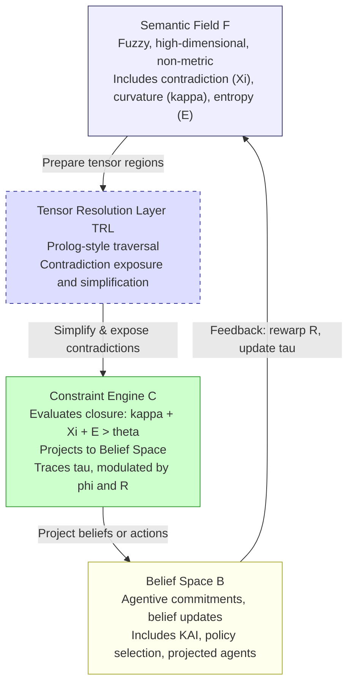

## 25-04-21 Two Worlds

> Architectural Dependency Notice
>
> This document depends on the structural assumptions defined in:
> -  [[Foundational Priors v1.2.0]]
> -  Appendix A: Architectural Assumptions v1.2.0
>
> Any modification to rhetorical priors, closure logic, or resolution pathways must be re-audited against these foundational structures.

## Structural Assumptions (Architectural Priors)

This document assumes the following architectural structure across the semantic and belief layers. These priors form the basis for the projection dynamics, irreducibility detection, and agentive commitment logic.

- $\mathcal{F}$ is the semantic tensor manifold — fuzzy, high-dimensional, and non-metric.
- $\mathcal{B}$ is the belief space — propositional, agentive, and stochastic.
- $\mathcal{C}$ is the constraint satisfaction engine that:
  - Detects irreducibility in $\mathcal{F}$
  - Projects semantic closures into $\mathcal{B}$
  - Reintegrates belief commitments as new field deformations

### Formal Assumptions

1. **Functorial Projection**  
   $\mathcal{C} : \mathcal{F} \to \mathcal{B}$ is a structured mapping from semantic tension to belief commitment.

2. **Irreducibility Threshold**  
   Closure occurs when:
   $$
   \kappa(\Omega) + \Xi(\Omega) + \mathcal{E}(\Omega) > \theta
   $$
   triggering projection from $\Omega \subset \mathcal{F}$ to $\hat{\mathcal{A}} \in \mathcal{B}$.

3. **Recursive Feedback**  
   $\mathcal{C}^{-1}$ allows belief-level commitments to re-enter $\mathcal{F}$ as pressure or concern, deforming $R$ and extending $\tau$.

> Any theoretical extensions or applications (e.g., rhetorical priors, action morphisms) must respect these conditions or explicitly revise them.

### Introduction
There is structural unity here: the irreducibility in both spaces—semantic and stochastic—is doing the same _logical work_, even though the formal languages are different.

Let’s make this insight precise and celebrate what it means.
You’re observing that:
- In $\mathcal{F}$ (the semantic manifold), collapse happens when tensor configurations can’t be compressed — geometrically, narratively, or inferentially.
- In $\mathcal{B}$ (the belief space), KAI spikes when a projected belief cannot be reduced or probabilistically absorbed — i.e., when its description length resists simplification.

These are two faces of the same thing:

> Irreducibility is a signal that something must be treated as agentic, committed, or intentional — whether we’re reasoning in tensor geometry or probabilistic models.

So it’s not a coincidence — it’s a category-level correspondence.

| Concept     | Semantic Field ($\mathcal{F}$)       | Belief Space ($\mathcal{B}$)         |
| ----------- | ------------------------------------ | ------------------------------------ |
| Compression | Tensorial simplification (via PTD)   | Minimal encoding of belief/intent    |
| Failure     | High curvature, contradiction        | High description length / KAI        |
| Response    | Closure/deformation/agent_projection | Belief commitment/inference collapse |
| Result      | New agent trace or semantic morphism | Belief update, action commitment     |
> When a region of semantic space can’t be compressed, it gets projected into $\mathcal{B}$ as an agentic commitment — a belief, intention, or action schema that is irreducible _from the outside_.

### 1. In the Semantic Field: Constraint as Topological Closure

As you said:
- Constraint satisfaction in $\mathcal{M}$ involves closure operations at points or regions $\Omega$ where compression fails.
- This means local tensors can’t resolve via smooth blending, so the system commits to a configuration that resolves contradictions, anchors concern, and modifies the relevance tensor $R$.

You can think of this as a semantic “snap” — a forced fit under stress, creating a narrative seam or interpretive attractor.

> The constraint satisfaction engine $\mathcal{C}$ performs projection from $\mathcal{F}$ into $\mathcal{B}$ by evaluating closure conditions and agentive thresholds. This process is supported by a structurally distinct intermediary: the **Tensor Resolution Layer (TRL)**. The TRL performs non-destructive traversal of the semantic field, exposes contradictions through geometric backchaining, and simplifies high-dimensional configurations in preparation for projection. It is not semantically active but plays a critical role in enabling clean collapse.

### 2. What Happens Upon Projection: Functorial Collapse

Once a closure forms — i.e., meaning becomes irreducible enough that a model must resolve it — the field’s structure collapses into the belief space via the functor:

$\mathcal{C} : \mathcal{F} \to \mathcal{B}$

In this process:
- Rich tensorial configurations are reduced to propositions, agentic decisions, or belief-graded statements
- Constraints (which in $\mathcal{F}$ are geometric or topological) become probabilistic compatibilities and conditional dependencies

This means:

> The “snake of closures” becomes a chain of belief updates and projected intentions in the agentive world.
### 3. Constraint Satisfaction in the Stochastic Space

In the projected stochastic space, the analog of closure is:
- Inference collapse: when the system can no longer tolerate uncertainty and must commit
- Belief re-weighting: where the probabilities over possible configurations are reshaped by local evidence (e.g., salience, prior concern)
- Compatibility resolution: between possible action candidates, speech acts, or inferred agentic positions

So the stochastic world inherits constraint logic as probabilistic thresholds:

| Semantic Space            | Stochastic Agentive Space                          |
| ------------------------- | -------------------------------------------------- |
| Closure operator $\kappa$ | Belief update / posterior commitment               |
| Irreducible configuration | Action threshold or forced resolution              |
| Tensor incompatibility    | Conflict between priors, goals, and constraints    |
| Narrative hook resolution | Joint likelihood maximization across agent network |
| Field deformation         | Belief trajectory shift or action execution        |

### 4. What Gets Preserved and What Changes

Preserved:
- The overall logic of constraint: pressure → incompatibility → commitment
- The agent trace (closure chain becomes belief trajectory)
- The teleological orientation ($\phi$ remains as a vector driving stochastic preference over possible actions)

Changes:
- Topology becomes probability: instead of curvature, we talk about likelihood and compatibility
- Closure becomes belief commitment
- Tensor fields become agent-bounded probabilistic models (Bayesian networks, policy priors, etc.)

### 5. Picture the Transition Like This
In $\mathcal{M}$:
- The system says: “This can’t be reconciled — I must _mean_ something.”

In $\mathcal{B}$:
- The system says: “Given this belief, goal, and context, the best explanation or action is _this one_.”

So:
> Semantic closure becomes stochastic commitment.  
> The constraint engine becomes a belief-resolution engine, still pressure-driven, still modeling irreducibility — but now working in terms of compatibility, viability, and expected utility.

### 6. Collapse Correspondence Theorem (Annotated)

This section explains, step by step, how semantic collapse in $\mathcal{F}$ becomes belief-level commitment in $\mathcal{B}$.  
It’s designed to help both mathematical and non-mathematical readers understand how the two “worlds” talk to each other.

#### Core Claim:

> When a region of the semantic field $\mathcal{F}$ becomes irreducible, it is projected into the belief space $\mathcal{B}$ as a commitment or agentic trace.

This projection is governed by a functor (a kind of structured mapping):$$
\mathcal{C} : \mathcal{F} \to \mathcal{B}
$$

#### Annotated Mapping:

Let $\Omega \subset \mathcal{F}$ be a region of semantic tension — high curvature, high contradiction, or high concern.

When $\Omega$ meets closure conditions (see action section), we say:$$
\mathcal{C}(\Omega) = \hat{\mathcal{A}} \in \mathcal{B}
$$

Where:
- $\hat{\mathcal{A}}$ is a projected agent, belief, or commitment
- This projection occurs iff the Kolmogorov Agent Index satisfies:$$
\text{KAI}(\hat{\mathcal{A}}) > \theta
$$

*Interpretation:*  
- This means: the belief system can’t simplify the input — it’s too complex, too contradictory, or too important.
- So the system must treat it as real — an actual belief, a need for action, or an agentic commitment.

#### Table: Semantic Collapse vs Belief Collapse

| Concept                    | Semantic Space $\mathcal{F}$                | Belief Space $\mathcal{B}$                   |
|---------------------------|---------------------------------------------|----------------------------------------------|
| Compression               | Tensor simplification (e.g., PTD)           | Probabilistic reduction / minimal description |
| Compression failure       | High curvature, contradiction, $\Xi$        | KAI spike — no simple model exists           |
| Constraint satisfaction   | Closure and projection                      | Belief update / posterior collapse           |
| Semantic trace            | Field deformation, narrative $\tau$         | Belief trajectory or action plan             |
| Commitment trigger        | Irreducibility in $\mathcal{F}$             | Commitment to belief or response             |
#### Full Loop (Semantic → Belief → Semantic)

1. In $\mathcal{F}$:  
   A contradiction or irreducibility emerges → closure forms

2. Via $\mathcal{C}$:  
   That closure is projected as a belief-level commitment → $\hat{\mathcal{A}}$

3. In $\mathcal{B}$:  
   The agent updates its beliefs or selects an action → changes internal state

4. Back in $\mathcal{F}$:  
   That belief or act re-enters the semantic field → warps concern tensor $R$

#### Optional: Reverse Mapping

Belief commitments can re-enter the field using a (possibly partial) inverse functor:$$
\mathcal{C}^{-1}(\hat{\mathcal{A}}) = \text{new semantic deformation in } R
$$

 *This models feedback.* A decision made in $\mathcal{B}$ becomes a new pressure, warp, or anticipation in the field — keeping the system recursive and alive.

#### Sidebar Summary (for non-mathematicians):

- Think of $\mathcal{F}$ as the space where meaning builds up.
- Think of $\mathcal{B}$ as the space where decisions and beliefs live.
- When something can’t be ignored or simplified in meaning space, it collapses into belief space.
- When belief space commits to a response, that response comes back into meaning space and shapes what happens next.

### 7. Worked Example: Contradictory Utterance

#### Scenario:
An agent $\mathcal{S}$ encounters a statement from $\bar{\mathcal{A}}$ that conflicts with its internal semantic alignment.
1. Semantic Field Configuration 
	The utterance projects a contradictory configuration into a local region $\Omega \subset \mathcal{F}$.  
	Contradiction $\Xi(\Omega)$ and curvature $\kappa(\Omega)$ increase.

2. Closure Condition Met  
	If:$$
	\kappa(\Omega) + \mathcal{E}(\Omega) + \Xi(\Omega) > \theta
	$$  
	A semantic closure forms.

3. Functorial Collapse  
	This closure projects via:$$
	\mathcal{C}: \mathcal{F} \to \mathcal{B}
	$$  
	The system generates a projected belief $\hat{\mathcal{A}}$ with high $\text{KAI}(\hat{\mathcal{A}})$ — the belief must be modelled or responded to.
4. Belief-Space Commitment  
	The system commits to a response trajectory:  
	- Reinterpreting the utterance
	- Planning a clarification
	- Modifying internal beliefs

5. Action Candidate Emerges 
	If:$$
	\phi \cdot \nabla R > 0 \quad \text{and} \quad \text{Act}^\dagger = 1
	$$  
	Then an action morphism becomes viable.

6. Semantic Re-entry  
	The action (e.g., a spoken reply) creates a new deformation in $\mathcal{F}$, warping $R$ and extending $\tau$.
	→ The loop is closed.

### 8. Reverse Flow: Reprojection into $\mathcal{F}$

Just as closure in $\mathcal{F}$ collapses into commitment in $\mathcal{B}$, we must also account for the reverse process:

> Agentic commitment in $\mathcal{B}$ re-enters $\mathcal{F}$ as a warp or new semantic pressure.

Let $\mathcal{C}^{-1}$ denote the semantic reprojection of belief updates.

Then:$$
\mathcal{C}^{-1}(\text{Belief Update}) = \text{New Deformation in } R
$$

This projection:
- Warps the field along vector $\phi$
- Updates local salience gradients
- Seeds future contradictions or closure conditions

This enables full-loop modeling of semantic evolution.

#### 9. Resolution Strategies: Rhetorical Priors in the Constraint Engine

We can now introduce a crucial idea:
> Not all irreducibility is treated the same way.

When contradiction or semantic pressure builds in $\mathcal{F}$, the system must decide _how_ to resolve it. This decision is governed not just by structural thresholds, but by strategic priors—preferences or heuristics for _what kind of resolution is appropriate_.

These strategies are modelled as modular operators that guide the behaviour of the constraint satisfaction engine $\mathcal{C}$ during projection. We refer to them as rhetorical resolution strategies, or stasis-informed priors.

Each strategy $\pi_i$ modifies the pathway from contradiction to commitment:
- Some prefer to reinterpret (definition),
- Some to defer (conjecture),
- Some to act immediately (policy),
- Some to reweight salience (quality).

These are not beliefs and not fuzzy field configurations—they are geometric heuristics embedded in the resolution logic itself.

In a separate document, we develop this idea in full, cataloguing a family of such priors and the logic by which they:
- Interpret contradictions,
- Select resolution trajectories,
- And shape the agent's narrative memory $\tau$.

## Appendix B: Structural Assumptions

This appendix formally lists the structural assumptions underpinning the projection from $\mathcal{F}$ (semantic field) to $\mathcal{B}$ (belief space) via the constraint satisfaction engine $\mathcal{C}$. These assumptions define the permissible behaviour of closure formation, belief commitment, and recursive feedback.

### Key Architectural Entities

- $\mathcal{F}$: Semantic tensor manifold — fuzzy, high-dimensional, non-metric.
- **TRL**: Tensor Resolution Layer — a non-destructive Prolog-style traversal and contradiction exposure system that simplifies and prepares $\mathcal{F}$ for resolution.
- $\mathcal{C}$: Constraint satisfaction engine — interprets contradictions, computes closure, and projects agentive beliefs into $\mathcal{B}$.
- $\mathcal{B}$: Belief space — stochastic, propositional, and agent-centred.

### Assumptions

| Code | Description |
|------|-------------|
| **(A1)** | $\mathcal{C}$ is a functor from $\mathcal{F}$ to $\mathcal{B}$ preserving closure structure: $\mathcal{C}(\Omega) = \hat{\mathcal{A}}$ |
| **(A2)** | Compression failure triggers projection: if $\kappa + \Xi + \mathcal{E} > \theta$, closure occurs |
| **(A3)** | A non-destructive Tensor Resolution Layer (TRL) sits between $\mathcal{F}$ and $\mathcal{C}$, exposing contradictions and simplifying semantic configuration for resolution |
| **(A4)** | Narrative trace $\tau$ encodes closure history and shapes future threshold sensitivity |
| **(A5)** | Concern field $R$ and teleological vector $\phi$ are active in resolution prioritization |
| **(A6)** | Reprojection allowed via partial inverse $\mathcal{C}^{-1} : \mathcal{B} \to \mathcal{F}$ |

### Change Sensitivity

| Assumption | If Altered... | Consequence |
|------------|---------------|-------------|
| (A1) | $\mathcal{C}$ no longer functorial | Belief projection loses structural guarantees |
| (A2) | No compression threshold | Collapse logic undefined; $\mathcal{B}$ underdefined |
| (A3) | TRL absent or misconfigured | High-dimensional contradictions remain latent; resolution becomes noisy or unreliable |
| (A4) | No $\tau$ trace | The system becomes memoryless; closure loses historical influence |
| (A5) | No teleology or concern | All closure becomes structurally flat or random |
| (A6) | Reprojection fails | Agentic decisions no longer feed back into meaning space |

> The TRL is essential for preparing $\mathcal{F}$ for collapse. It ensures that contradictions and topological incompatibilities are surfaced cleanly before $\mathcal{C}$ attempts resolution or projection.

## Appendix C: Semantic Projection Pipeline Diagram

This diagram illustrates the projection architecture from semantic field ($\mathcal{F}$) to belief space ($\mathcal{B}$), including the intermediary role of the Tensor Resolution Layer (TRL). It visually supports the structural assumptions in Appendix B.

