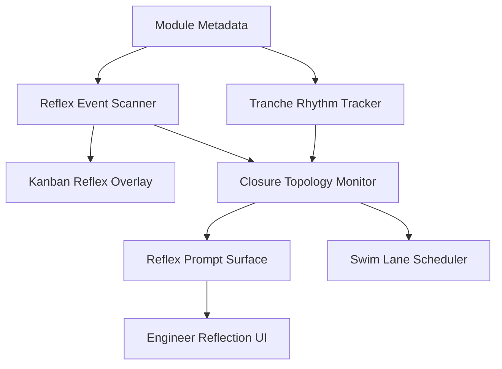

# Infrastructure Requirements Draft v1.1

## 1.1 Motivating Constraints

> Why build an infrastructure layer?

- Maintain clean traceability of all modules and design decisions.
- Allow distributed, asynchronous, reproducible engineering collaboration.
- Support open-ended expansion without loss of coherence or semantic integrity.
- Minimise bespoke tooling unless absolutely necessary (reuse open-source tools).
- Lower the barrier to entry for coding collaborators like Ben.

## 1.2 Core Categories of Infrastructure

| Need                        | Purpose                                                   | Possible Tools / Strategies |
|------------------------------|-----------------------------------------------------------|------------------------------|
| Version Control              | Track changes, module versions, audit history             | Git, Conventional Commits    |
| Documentation & Audit Trails | Store Modular Epistemology specs, PV mappings, changelogs  | Markdown (Obsidian, Git Docs)|
| Test and Validation Framework| Verify module invariants and Minimal Viable Traces (MVTs)  | Rust's `cargo test`, MVT checks |
| Visualisation Scaffolding    | Render tensor fields, closure maps, constraint graphs     | SageMath, Graphviz, Mermaid  |
| Meta-Logging & Provenance    | Record AI/human contribution trails, rationale annotations| YAML or JSON trace files     |
| Reflex Loop Awareness       | Coordinate theory–engineering feedback via ERL | Reflex metrics, Kanban overlays, closure monitors |
| Tranche Sync Coordination   | Surface group-level coherence targets and drift | Tranche metadata blocks, rhythm-aware scheduler |
| Closure Topology Monitor    | Track global belief stability across system     | Drift metrics, lane tension scores, visual dashboard |
| Reflex Participation Prompts| Surface reflex events and contradiction markers | Kanban overlays, module metadata, `@reflex_event` |


## 1.3 Immediate Infrastructure Priorities

| Priority | Action Item                         | Notes                  |
|----------|--------------------------------------|-------------------------|
| P1       | Set up Git repository structure      | With module directories |
| P2       | Define Markdown templates            | For Module Specs & Logs |
| P3       | Create MVT checklist template        | To validate outputs     |
| P4       | Choose lightweight visualisation tool| For early tensor diagrams|
| P5       | Define meta-logging format (YAML)     | Tag AI/human sources    |

## 1.4 Open Tool Selection Questions

- Should we use GitHub/GitLab/Gitea for hosting?
- Would a very lightweight issue-tracker help (for audit tasks)?
- Should we scaffold SageMath notebooks immediately, or build simple Rust-based exporters first?
- Should meta-logs be embedded in code comments, or external `.meta.yaml` files per module?

## 1.5 Guiding Principles

- Minimum Viable Infrastructure First. Start lean, extend as necessary.
- External Tool Preference. Use open, well-supported tools wherever possible.
- Traceability Over Convenience. Always preserve the link from artefact to method.
- Non-Intrusive Observation. Visualisation and trace capture must not disturb module runtime behaviour.
- Human-First Collaboration. All contributors, including Ben, must feel confident in navigating and extending the system.
- Epistemic Reflexivity Is Native. System must support reflex coordination between theory and engineering, without adding burden or coercion.


## 1.6 Next Steps

- [ ] Approve basic infrastructure design (Ben + Bee review)
- [ ] Create first repository structure and commit templates
- [ ] Draft first module specs using Modular Epistemology templates
- [ ] Choose MVT verification and visualisation tooling

## 1.7 Repository Structure Sketch


To support Modular Epistemology and Provenance Validation (PV), the project repository will adopt the following simple, expandable structure:

```plaintext

/ucse-project
  /docs               # All human-readable specs and notes
    foundational-priors.md
    modular-epistemology.md
    infrastructure-plan.md
    ucse-spec.md
  /src                # Source code by major module
    /ucse-engine      # Core UCSE constraint cycle
    /tensor-ops       # Tensor decompositions and projections
    /constraint-layer # Rhetorical priors, constraint morphisms
    /scaffold-system  # Rolling closures, scaffolding
    /visualization    # Non-intrusive field visualizers
  /tests              # Unit and integration tests
  /visual             # Static visual artefacts, Mermaid, SageMath diagrams
  /logs               # MVTs, scaffold traces, provenance logs
```

## 1.8 Immediate Tool Choices

| Domain               | Tool/Method                      | Rationale                     |
| -------------------- | -------------------------------- | ----------------------------- |
| Version Control      | Git + GitHub (for now)           | Easy onboarding, visibility   |
| Visualisation        | SageMath + Mermaid (early phase) | Lightweight, scriptable       |
| Documentation Format | Markdown (Obsidian-compatible)   | Traceable, PV-tagged          |
| Meta-Logging         | External `.meta.yaml` per module | Clean separation, reusability |

## 1.9 Reflex and Closure Middleware Integration

To support epistemic reflexivity, the infrastructure must surface and trace:

- Reflex loop participation (`Projection`, `Contradiction`, `Reflection`)
- Systemic closure drift (open vs. refuted module ratio)
- Tranche synchrony across swim lanes
- Designer-level reflex logs, even when not manually declared

This requires middleware capable of:

- Reading module metadata for `@reflex_event`, `@closure`, `@tranche`
- Aggregating reflex data into the Closure Topology Monitor (§10, MEEM)
- Prompting lightweight reflex declaration during refactor, test fail, or scope divergence

This is implemented through:

- Reflex Event Scanner (non-blocking, passive)
- Tranche Rhythm Scheduler (drift-aware lane cycler)
- Closure Topology Monitor (running drift integral across modules)
- Reflex Prompt Surface (suggests `@reflex_log:` when contradiction metrics spike)

These do not coerce compliance — they make epistemic state *legible*.

## 1.10 Middleware Data Flow



We define closure drift acceleration as:

$$
\frac{d}{dt}\left(\frac{N_{\text{refuted}}}{N_{\text{closed}} + \varepsilon}\right)
$$

Where:
- $N_{\text{refuted}}$ = number of modules tagged `@closure:refuted`
- $N_{\text{closed}}$ = modules tagged `@closure:provisional` or `@closure:enabled`
- $\varepsilon$ = small constant to avoid division instability

This metric flags zones of epistemic instability, which are surfaced to engineers during reflex pass.


## 1.11 Final Confirmation for v1.1

> The Infrastructure Requirements Plan v1.0 is now complete pending:

- GitHub repository initialisation,
- Creation of `/docs`, `/src`, `/tests`, `/logs`, `/visual`,
- Seeding with the Modular Epistemology templates and PV headers.

Once the repository skeleton is created and initial docs pushed,  
we can cleanly begin engineering the UCSE Engine Specification Plan.

✅ No open dependencies.  
✅ Modular epistemology preserved.  
✅ Infrastructure traceability ready.

---

> Companion Document  
> → [[UCSE Engine Specification Plan Draft v1.0]] (forthcoming)

> Architectural Dependency  
> Infrastructure must conform to Modular Epistemology for Engineering Modules [[modular-epistemology-engineering-modules]] and Provenance Validation codes ⬡PV-E0.1–⬡PV-E11.x.


<!-- README.md
# Semantic Agency Architecture – Engineering Repository

This repository supports the engineering implementation of the Semantic Agency Architecture, focusing on modular, auditable, and theory-faithful design.

## Project Overview

This project builds a constraint-aware, tensor-based semantic system with agentive closure and rhetorical modulation.  
It follows the Modular Epistemology for Engineering Modules and aligns all components with the Provenance Validation system.

Key modules include:

- **UCSE** – Unified Constraint Satisfaction Engine
- **TRL** – Tensor Resolution Layer
- **CMS** – Constraint Morphism Stack
- **Rhetorical Priors** – πₖ-modulated inference strategies
- **Semantic Fields** – Tensor manifolds and relevance-driven dynamics

---

## Repository Structure

- `/modules/`
  - `ucse/` — UCSE engine core logic
  - `constraint_layer/` — Constraint detection & enforcement
  - `rhetorical_modulation/` — π-prior morphism system
  - `scaffold_operator/` — Rolling closure and promotion
- `/docs/`
  - `foundational_priors.md`
  - `modular_epistemology.md`
  - `ucse_spec.md`
- `/logs/`
  - `trace_outputs/`
  - `meta_logs/`
- `/test/`
  - `unit/`
  - `integration/`
- `/visual/`
  - `diagrams/`
  - `field_renderings/`

---

## Tooling

- **Language**: Rust (primary), with optional SageMath for tensor visualization.
- **Version Control**: Git + Conventional Commits
- **Testing**: `cargo test`, with module-specific MVT verification
- **Visualization**: Mermaid, Graphviz, SageMath (read-only render)

---

## Modular Epistemology

All modules conform to:

- `Modular Epistemology for Engineering Modules v1.1`
- PV codes `⬡PV-E0.1–⬡PV-E11.x`
- Semantic safety, constraint fidelity, and symbolic coherence standards

---

## Traceability & Logs

Each module must include:

- **Minimal Viable Trace (MVT)**: non-invasive runtime log
- **Meta-logs**: `.meta.yaml` for provenance of AI- or human-generated artifacts
- **Perturbation map**: failure mode sensitivity for key functions

---

## Getting Started

1. Clone the repo
2. Check `/docs/infrastructure_requirements.md`
3. Follow the PV-based checklist in each module
4. Use `/logs/` to track outputs and audit traces

---

## Contributor Covenant

We build carefully, transparently, and ethically.  
Contributions must preserve traceability, symbolic coherence, and architectural faithfulness.

---

This repository is not just a codebase — it’s a semantic structure that grows.  
Welcome to the architecture.
-->

<!--Git structure sketch
/ucse-project
  /docs
    foundational-priors.md
    modular-epistemology.md
    infrastructure-plan.md
    ucse-spec.md
  /src
    /ucse-engine
    /tensor-ops
    /constraint-layer
    /scaffold-system
    /visualization
  /tests
  /visual
  /logs
-->