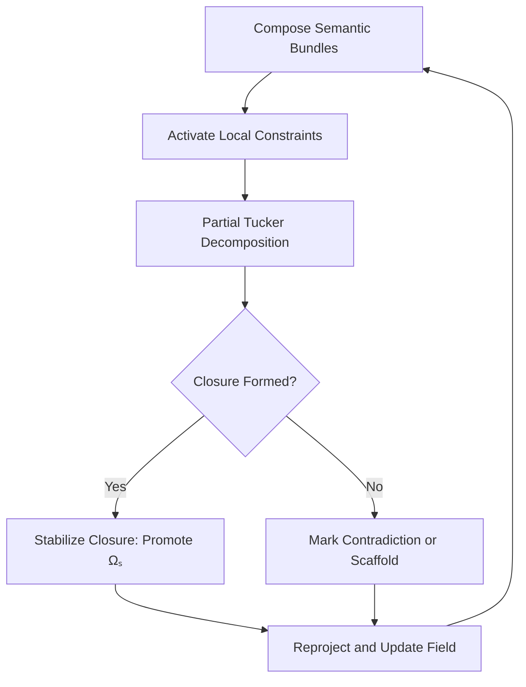

# Unified Constraint Satisfaction Engine (UCSE)

> NOTE (May 2025):  
> Updated to fully align with the updated Foundational Priors v2.2.  
>  
> UCSE now assumes $\mathcal{B}$ is a topological-stochastic field (not a node graph);  
> Agent modeling embeds functorial mappings $\mathcal{F} \to \mathcal{B}$ with traceability;  
> Scaffold Operators and enhanced semantic tension metrics introduced.  
>  
> New features:  
> • Explicit field-stochasticity affirmation  
> • Modular scaffold promotion  
> • Local semantic tension metrics (τ, κ, ℰ residuals)

## 1. Overview

The UCSE composes, interrogates, and reconciles semantic tensor fields under active constraints.  
Its goal is dynamic coherence — not symbolic truth — achieved through local field adaptation and recursive closure sharpening.

UCSE performs:

- Contradiction detection (via local curvature, entropy, residual PTD)
- Partial dimensional condensation (Partial Tucker Decompositions)
- Closure formation and scaffold promotion
- Semantic tension-guided traversal and reduction

Fundamental shift:
- Belief space $\mathcal{B}$ is a continuous, topological, stochastic field, not a graph.
- Discretisation (Voronoi, Delaunay) are computational artefacts, not primary ontology.

## 1.1 Motivating Intuition
⬡[PV0.1]

Semantic resolution is not binary truth evaluation — it is the dynamic reconciliation of semantic fields under tension.  
In environments of layered meaning and agentive interpretation, contradictions are not errors; they are forces seeking closure.  
The Unified Constraint Satisfaction Engine (UCSE) formalises a process of reconciling these tensions through dynamic field adaptation, enabling closure formation without assuming fixed truths.

UCSE exists because static logical reasoning is insufficient for meaning in evolving, agent-driven environments.

## 1.2 Implicit Questions
⬡[PV1.x] ⬡[PV2.x]

| Question | Why it matters | Linked PV |
|----------|----------------|-----------|
| Q1. How is semantic contradiction detected without discrete symbols? | Detects tension intrinsically via tensor deformation. | ⬡[PV1.2] |
| Q2. How are semantic regions condensed without losing structure? | Enables dynamic closure without total collapse. | ⬡[PV2.2] |
| Q3. How are partial closures scaffolded for later promotion? | Models unresolved belief formation and latent commitment. | ⬡[PV3.7] |
| Q4. How is agentive formation anchored? | Projects warps and irreducibilities from $\mathcal{F}$ to $\mathcal{B}$. | ⬡[PV4.2] |
| Q5. How is the belief space preserved as a topological field? | Ensures meaning remains continuous and stochastic, not graph-like. | ⬡[PV1.3.1] |

## 1.3 Formal Structure
⬡[PV1.x] ⬡[PV2.x] ⬡[PV3.x]

Core Objects:
- $\mathcal{F}$: Fuzzy semantic tensor manifold
- $\mathcal{B}$: Stochastic, topological belief space ⬡[PV1.3.1]
- $\mathcal{C}$: Constraint functor $\mathcal{C}: \mathcal{F} \to \mathcal{B}$
- $R$: Relevance field ⬡[PV1.1]
- $\Xi$: Contradiction tensor field ⬡[PV1.2]
- $\phi$: Pre-agentive teleological vector field ⬡[PV1.5]

Main Operations:
- Partial Tucker Decomposition (PTD) ⬡[PV2.2]
- Geometric scaffolding (Voronoi partitions, Delaunay graphs)
- Closure detection via tension aggregation (curvature + entropy + PTD residuals)
- Scaffold promotion when partial closure regions stabilize ⬡[PV3.7]
- Projection into $\mathcal{B}$ maintaining topological continuity ⬡[PV1.3.1]
- Agent warp projection ($\gamma, \tau, \phi$) defining functorial closures ⬡[PV4.2]

Constraint Cycle:
Compose Bundles → Activate Constraints → PTD on Mode Subset → 
Closure? → Stabilise or Scaffold → Reproject → Repeat

## 1.4 What This Elucidates
⬡[PV3.x] ⬡[PV4.x]

| Q → A synthesis | Key PV link |
|-----------------|-------------|
| How are contradictions detected? | As local peaks in $\Xi$ curvature and PTD residuals. ⬡[PV1.2] |
| How are closures non-binary and progressive? | Scaffolds (Ωₛ) allow gradual closure formation. ⬡[PV3.7] |
| Why isn't belief discrete? | Projection preserves stochastic topology of $\mathcal{B}$. ⬡[PV1.3.1] |
| How is agency structurally anchored? | Warp traces ($\gamma, \tau, \phi$) define irreducible closure loci. ⬡[PV4.2] |

## 1.5 Background (Expanded)

The UCSE module inherits foundational assumptions from Foundational Priors v2.2:

- Semantic field $\mathcal{F}$ modeled as a high-dimensional tensor manifold ⬡[PV1.1].
- Belief space $\mathcal{B}$ treated as a continuous, stochastic topological field ⬡[PV1.3.1].
- Projection $\mathcal{C}: \mathcal{F} \to \mathcal{B}$ preserves topological and stochastic structure ⬡[PV1.3].

> Important Clarification:  
> Discrete partitions (e.g., Voronoi regions, Delaunay triangulations) are computational artefacts derived locally for traversal, but they do not alter the continuous, field-like nature of $\mathcal{B}$.

Thus, all closure projections, scaffold formations, and agent emergence occur within a topological space where smooth deformation, curvature, and stochastic tension govern dynamics.

- Closure projection via $\mathcal{C}$ ⬡[PV1.3]
- Contradiction detection from $\Xi$ ⬡[PV1.2]
- Closure threshold κ + ℰ + Ξ > θ ⬡[PV2.2]
- Scaffold operator pathway ⬡[PV3.7]
- Triadic closure structure (𝒮, 𝔸̄, Â) ⬡[PV4.2]

## 1.6 Formal Dependencies
⬡[PV-Header]

|PV Tag|Depends on formal object(s)|
|---|---|
|⬡PV1.1|Relevance field $R$|
|⬡PV1.2|Contradiction tensor $\Xi$|
|⬡PV1.3|Projection functor $\mathcal{C}$|
|⬡PV1.3.1|Belief space $\mathcal{B}$ as a topological field|
|⬡PV1.5|Pre-agentive teleological field $\phi_{\text{pre}}$|
|⬡PV2.2|Closure threshold formula|
|⬡PV3.7|Scaffold operator|
|⬡PV4.2|Triadic agent schema|

## 1.7 Sensitivity and Perturbation Mapping
⬡[PV-Sensitivity]

| PV Code | If it changes … | Consequence |
|---------|-----------------|-------------|
| ⬡PV1.2 | Redefine $\Xi$ or contradiction interpretation | Tension detection invalid |
| ⬡PV1.3 | $\mathcal{C}$ loses functoriality | Belief projections break |
| ⬡PV1.3.1 | Treat $\mathcal{B}$ as a graph | Topological continuity broken |
| ⬡PV2.2 | Closure threshold altered | Closure triggers become unreliable |
| ⬡PV3.7 | Scaffold promotion logic removed | Gradual closure dynamics lost |
| ⬡PV4.2 | Triadic schema changed | Agentive commitment modeling fails |

## 2. Conceptual Stack

### 2.1 Tensor Modes

| Mode | Interpretation |
|-----|-----------------|
| $M_1$ | Conceptual (proposition) content |
| $M_2$ | Affective modulation (emotional bias) |
| $M_3$ | Rhetorical stance (stasis vector) |
| $M_4$ | Temporal activation memory |
| $M_5$ | Agent-indexed intentional stance |

Modes are latent — PTDs can be applied flexibly across mode subsets.

## 2.2 Constraint Cycle

## 3. Partial Tucker Decomposition (PTD)

Given a tensor:

$$
T \in \mathbb{R}^{I_1 \times I_2 \times \dotsb \times I_n},
$$

select a mode subset:

$$
S = \{i_1, i_2, \dotsc, i_k\},
$$

and apply the partial Tucker decomposition:

$$
\text{PTD}_S(T) = \left( G; \{ A^{(i)} \}_{i \in S} \right),
$$

where:

- $G$ is the compressed core tensor,
- $A^{(i)}$ are the factor matrices for each selected mode $i$.

Interpretation:

- $G$ approximates a local semantic condensation over the selected modes $S$,
- High PTD residuals indicate local incoherence, contradiction, or unresolved semantic tension.

Categorical framing:

The partial decomposition acts as an internal morphism inside the semantic tensor category $\mathsf{SemField}$:

$$
\text{PTD}_S : T \longrightarrow G
$$

preserving structure through mode-selective compression.

## 4. Geometric Scaffold

1. Projection: Project tensor slice (metric-reduced).
2. Voronoi Partition: Coherence basins ${\mathcal{V}_j}$.
3. Delaunay Graph: Ridge relations $\mathcal{G}=(\mathcal{V},E)$.
4. Heuristics:
    - Ridge detection = contradiction front.
    - Fast traversal & reduction queries.

5. Re-injection: Geometry re-injected as adjacency tensors into $T$.

## 5. Rolling Closures and Scaffold Promotion (Expanded)

Closure processes in UCSE are not instantaneous.  
Instead, they occur through scaffold formation and gradual semantic stabilization:

- Partial closures ($\Omega_s$) represent regions of local condensation but incomplete commitment.
- Rolling closure dynamics allow scaffolds to persist across multiple UCSE cycles until semantic tension ($\mathcal{T}_{\text{local}}$) stabilizes.

Promotion condition:

$$
\mathcal{T}_{\text{local}} < \epsilon_{\text{promotion}}
$$

where $\epsilon_{\text{promotion}}$ is a dynamic, context-sensitive threshold.

If satisfied, scaffolds are promoted to stable closures, forming agentive or belief commitments.  
Otherwise, scaffolds remain provisional and continue evolving.

This enables gradual commitment without catastrophic collapse.

## 6. Local Semantic Tension Metrics (Expanded)

Semantic tension $\mathcal{T}_{\text{local}}$ is a unified scalar field derived from:

| Component | Meaning |
|-----------|---------|
| $\kappa$ | Local curvature of semantic field |
| $\mathcal{E}$ | Local entropy (informational dispersion) |
| PTD Residual | Deviation from low-rank closure in partial decomposition |
| $\tau_{jk}$ | Ridge tension between Voronoi regions |

Unified metric:

$$
\mathcal{T}_{\text{local}} = w_1 \kappa + w_2 \mathcal{E} + w_3 \left( \text{PTD residual} \right)
$$

where $w_1$, $w_2$, $w_3$ are dynamically tunable weights based on context.

> Diagnostic Use:  
> High $\mathcal{T}_{\text{local}}$ indicates semantic instability, guiding further decomposition, scaffold formation, or constraint intensification.

## 7. Agent Modeling in UCSE (Expanded)

Agents emerge from closure dynamics as:

- Functorial closures: 
  $$
  \mathcal{F} \overset{\mathcal{C}}{\longrightarrow} \mathcal{B}
  $$
- Warp-induced trace bundles:  
  $(\gamma, \tau, \phi)$ — defining concern persistence, narrative trace, and directional teleology.
- Irreducibility points:  
  Local regions where semantic tension cannot be resolved without agentive commitment.

Thus, agents are semantically stable, irreducible loci in $\mathcal{B}$, arising naturally from tensorial contradiction and closure failure resolution.

> Insight:  
> Agency is a *field property*, not a symbolic assignment.

## 8. Open Engineering Questions

- How are mode subsets $S$ selected dynamically for PTD?
- What decay kernels govern constraint activations (rhetorical fatigue)?
- How to structure efficient backtracking on high-tension scaffolds?
- How to formalize agent morphisms functorially between semantic stages?

# ⬡[PV Update Notice]

This module now requires Foundational Priors v2.2 as a parent reference for:

- Belief space topology ⬡[PV1.3.1]
- Closure condition ⬡[PV2.2]
- Pre-agentive teleology ⬡[PV1.5]
- Scaffold operator ⬡[PV3.7]